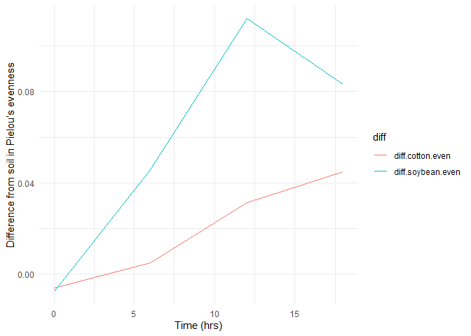

# Coding Challenge \_ Data Wrangling

``` r
#install.packages("tidyverse")
library(tidyverse)
```

    ## Warning: package 'ggplot2' was built under R version 4.4.3

    ## Warning: package 'purrr' was built under R version 4.4.2

    ## Warning: package 'lubridate' was built under R version 4.4.2

    ## ── Attaching core tidyverse packages ──────────────────────── tidyverse 2.0.0 ──
    ## ✔ dplyr     1.1.4     ✔ readr     2.1.5
    ## ✔ forcats   1.0.0     ✔ stringr   1.5.1
    ## ✔ ggplot2   3.5.1     ✔ tibble    3.2.1
    ## ✔ lubridate 1.9.4     ✔ tidyr     1.3.1
    ## ✔ purrr     1.0.4     
    ## ── Conflicts ────────────────────────────────────────── tidyverse_conflicts() ──
    ## ✖ dplyr::filter() masks stats::filter()
    ## ✖ dplyr::lag()    masks stats::lag()
    ## ℹ Use the conflicted package (<http://conflicted.r-lib.org/>) to force all conflicts to become errors

# 1. 3 pts. Download two .csv files from Canvas called DiversityData.csv and Metadata.csv, and read them into R using relative file paths.

``` r
DiversityData <- read.csv("DiversityData.csv")
str(DiversityData)
```

    ## 'data.frame':    70 obs. of  5 variables:
    ##  $ Code      : chr  "S01_13" "S02_16" "S03_19" "S04_22" ...
    ##  $ shannon   : num  6.62 6.61 6.66 6.66 6.61 ...
    ##  $ invsimpson: num  211 207 213 205 200 ...
    ##  $ simpson   : num  0.995 0.995 0.995 0.995 0.995 ...
    ##  $ richness  : int  3319 3079 3935 3922 3196 3481 3250 3170 3657 3177 ...

``` r
Metadata <- read.csv("Metadata.csv")

str(Metadata)
```

    ## 'data.frame':    70 obs. of  5 variables:
    ##  $ Code         : chr  "S01_13" "S02_16" "S03_19" "S04_22" ...
    ##  $ Crop         : chr  "Soil" "Soil" "Soil" "Soil" ...
    ##  $ Time_Point   : int  0 0 0 0 0 0 6 6 6 6 ...
    ##  $ Replicate    : int  1 2 3 4 5 6 1 2 3 4 ...
    ##  $ Water_Imbibed: chr  "na" "na" "na" "na" ...

# 2. 4 pts. Join the two dataframes together by the common column ‘Code’. Name the resulting dataframe alpha.

``` r
alpha  <- left_join(Metadata, DiversityData, by = "Code")
```

# 3. 4 pts. Calculate Pielou’s evenness index: Pielou’s evenness is an ecological parameter calculated by the Shannon diversity index (column Shannon) divided by the log of the richness column.

\#a. Using mutate, create a new column to calculate Pielou’s evenness
index. \#b. Name the resulting dataframe alpha_even.

``` r
# Creating a new column
alpha_even  <-  mutate(alpha, Pielou_eveness = shannon / log(richness))
```

# 4 4. Pts. Using tidyverse language of functions and the pipe, use the summarise function and tell me the mean and standard error evenness grouped by crop over time.

\#a. Start with the alpha_even dataframe \#b. Group the data: group the
data by Crop and Time_Point. \#c. Summarize the data: Calculate the
mean, count, standard deviation, and standard error for the even
variable within each group. \#d. Name the resulting dataframe
alpha_average

``` r
#summary statistics

alpha_average  <-  alpha_even %>%
    group_by(Crop, Time_Point) %>%
    summarise(mean.even = mean(Pielou_eveness), # calculating the mean richness, stdeviation, and standard error
            n = n(), 
            sd.dev = sd(Pielou_eveness)) %>%
    mutate(std.err = sd.dev/sqrt(n))
```

    ## `summarise()` has grouped output by 'Crop'. You can override using the
    ## `.groups` argument.

# 5. 4. Pts. Calculate the difference between the soybean column, the soil column, and the difference between the cotton column and the soil column

\#a. Start with the alpha_average dataframe \#b. Select relevant
columns: select the columns Time_Point, Crop, and mean.even.
\#c. Reshape the data: Use the pivot_wider function to transform the
data from long to wide format, creating new columns for each Crop with
values from mean.even. \#d. Calculate differences: Create new columns
named diff.cotton.even and diff.soybean.even by calculating the
difference between Soil and Cotton, and Soil and Soybean, respectively.
\#e. Name the resulting dataframe alpha_average2

``` r
alpha_average2 <- alpha_average %>%
              select(Time_Point, Crop, mean.even) %>%
              pivot_wider(names_from = Crop, values_from = mean.even) %>%
              mutate(diff.cotton.even = Soil - Cotton) %>%
              mutate(diff.soybean.even = Soil - Soybean)
```

# 6. 4 pts. Connecting it to plots

\#a. Start with the alpha_average2 dataframe \#b. Select relevant
columns: select the columns Time_Point, diff.cotton.even, and
diff.soybean.even. \#c. Reshape the data: Use the pivot_longer function
to transform the data from wide to long format, creating a new column
named diff that contains the values from diff.cotton.even and
diff.soybean.even. \#i. This might be challenging, so I’ll give you a
break. The code is below.

\#pivot_longer(c(diff.cotton.even, diff.soybean.even), names_to =
“diff”)

\#d. Create the plot: Use ggplot and geom_line() with ‘Time_Point’ on
the x-axis, the column ‘values’ on the y-axis, and different colors for
each ‘diff’ category. The column named ‘values’ come from the
pivot_longer. The resulting plot should look like the one to the right.

``` r
alpha_average2 %>%
  select(Time_Point, diff.cotton.even, diff.soybean.even) %>%
  pivot_longer(c(diff.cotton.even, diff.soybean.even), names_to = "diff") %>%
  ggplot(aes(x = Time_Point, y = value, color=diff)) + # Plot it 
  geom_line() +
  theme_minimal() +
  xlab("Time (hrs)") +
  ylab("Difference from soil in Pielou’s evenness")
```

<!-- -->

# Below is the clickable link to manuscript where these data are published

[Coding_challenge_5
Folder](https://github.com/ppg0001/PLPA_Assignment/tree/main/Coding_challenge_5)
