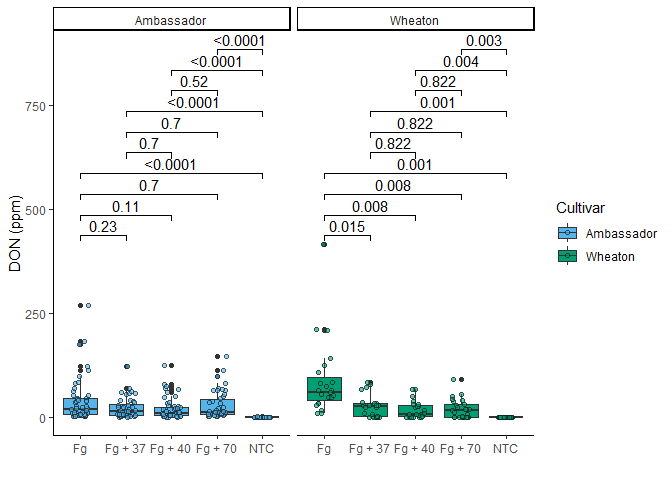
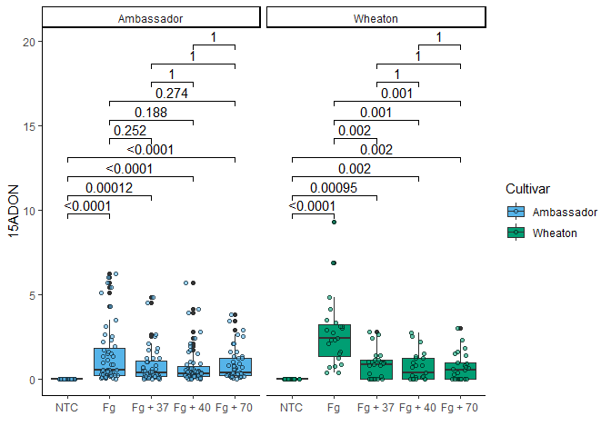
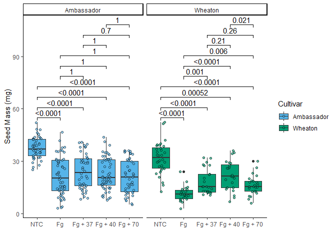

# Coding Challenge 4 Answers

# Q1) Explain the following

1.  YAML header YAMLS helps in writing the configuration of the files
    and is on the top of the markdown files.

2.  Literate programming In literate programming along with our code we
    will have its explanations and provide the chunks of codes.
    Itexplains the codes in bettwe way.

# Q2)

# Below is the clickable link to manuscript where these data are published

[Noel et al., 2022. Endophytic fungi as promising biocontrol agent to
protect wheat from Fusarium graminearum head blight. Plant
Disease](https://doi.org/10.1094/PDIS-06-21-1253-RE)

``` r
## Load libraries
library(tidyverse)
```

    ## ── Attaching core tidyverse packages ──────────────────────── tidyverse 2.0.0 ──
    ## ✔ dplyr     1.1.4     ✔ readr     2.1.5
    ## ✔ forcats   1.0.0     ✔ stringr   1.5.1
    ## ✔ ggplot2   3.5.1     ✔ tibble    3.2.1
    ## ✔ lubridate 1.9.3     ✔ tidyr     1.3.1
    ## ✔ purrr     1.0.2     
    ## ── Conflicts ────────────────────────────────────────── tidyverse_conflicts() ──
    ## ✖ dplyr::filter() masks stats::filter()
    ## ✖ dplyr::lag()    masks stats::lag()
    ## ℹ Use the conflicted package (<http://conflicted.r-lib.org/>) to force all conflicts to become errors

``` r
library(ggpubr)
library("knitr")  # required for knitting


## Reading data by reative path

csv <- read.csv("MycotoxinData.csv", na.strings = "na")
head (csv)
```

    ##   Treatment Cultivar BioRep MassperSeed_mg   DON X15ADON
    ## 1        Fg  Wheaton      2      10.291304 107.3    3.00
    ## 2        Fg  Wheaton      2      12.803226  32.6    0.85
    ## 3        Fg  Wheaton      2       2.846667 416.0    3.50
    ## 4        Fg  Wheaton      2       6.500000 211.9    3.10
    ## 5        Fg  Wheaton      2      10.179167 124.0    4.80
    ## 6        Fg  Wheaton      2      12.044444  73.1    3.30

``` r
## Codes needed for complete analysis

#Plot1 Treatment on Y

P1 <- ggplot(csv, aes(x = Treatment, y = DON, fill = Cultivar))+
  theme_classic() +                # removes the grids
  geom_boxplot() + 
  xlab("") +
  ylab("DON (ppm)") +
  geom_point(alpha = 0.6, shape = 21, position = position_jitterdodge()) +
  scale_fill_manual (values = c("#56B4E9", "#009E73")) +
  facet_wrap(~ Cultivar) 

str(csv)
```

    ## 'data.frame':    375 obs. of  6 variables:
    ##  $ Treatment     : chr  "Fg" "Fg" "Fg" "Fg" ...
    ##  $ Cultivar      : chr  "Wheaton" "Wheaton" "Wheaton" "Wheaton" ...
    ##  $ BioRep        : int  2 2 2 2 2 2 2 2 2 3 ...
    ##  $ MassperSeed_mg: num  10.29 12.8 2.85 6.5 10.18 ...
    ##  $ DON           : num  107.3 32.6 416 211.9 124 ...
    ##  $ X15ADON       : num  3 0.85 3.5 3.1 4.8 3.3 6.9 2.9 2.1 0.71 ...

``` r
csv$Treatment <- factor(csv$Treatment, levels = c("NTC", "Fg","Fg + 37", "Fg + 40", "Fg + 70"))


#Plot2 X15ADON on Y

P2 <- ggplot(csv, aes(x = Treatment, y = X15ADON, fill = Cultivar))+
  theme_classic() +                # removes the grids
  geom_boxplot() + 
  xlab("") +
  ylab("15ADON") +
  geom_point(alpha = 0.6, shape = 21, position = position_jitterdodge()) +
  scale_fill_manual (values = c("#56B4E9", "#009E73")) +
  facet_wrap(~ Cultivar) 


#Plot3 MassperSeed_mg on Y

P3 <- ggplot(csv, aes(x = Treatment, y = MassperSeed_mg, fill = Cultivar))+
  theme_classic() +                # removes the grids
  geom_boxplot() + 
  xlab("") +
  ylab("Seed Mass (mg)") +
  geom_point(alpha = 0.6, shape = 21, position = position_jitterdodge()) +
  scale_fill_manual (values = c("#56B4E9", "#009E73")) +
  facet_wrap(~ Cultivar)
```

## Code from coding challenge 3, question 5 & sepreated code chunks for each plit

``` r
P1_stat <- P1 + 
            geom_pwc(aes(group = Treatment), method = "t_test", label = "p.adj.format")
P1_stat
```

    ## Warning: Removed 8 rows containing non-finite outside the scale range
    ## (`stat_boxplot()`).

    ## Warning: Removed 8 rows containing non-finite outside the scale range
    ## (`stat_pwc()`).

    ## Warning: Removed 8 rows containing missing values or values outside the scale range
    ## (`geom_point()`).

<!-- -->

``` r
P2_stat <- P2 + 
  geom_pwc(aes(group = Treatment), method = "t_test", label = "p.adj.format")
P2_stat
```

    ## Warning: Removed 10 rows containing non-finite outside the scale range
    ## (`stat_boxplot()`).

    ## Warning: Removed 10 rows containing non-finite outside the scale range
    ## (`stat_pwc()`).

    ## Warning: Removed 10 rows containing missing values or values outside the scale range
    ## (`geom_point()`).

<!-- -->

``` r
P3_stat <- P3 + 
  geom_pwc(aes(group = Treatment), method = "t_test", label = "p.adj.format")
P3_stat
```

    ## Warning: Removed 2 rows containing non-finite outside the scale range
    ## (`stat_boxplot()`).

    ## Warning: Removed 2 rows containing non-finite outside the scale range
    ## (`stat_pwc()`).

    ## Warning: Removed 2 rows containing missing values or values outside the scale range
    ## (`geom_point()`).

<!-- -->

``` r
#combining
Combined_plot_stat <- ggarrange(
  P1_stat,   ## add the plots onf interest subsequently
  P2_stat,
  P3_stat,
  labels = "auto",  # Automatically label the plots (A, B, C, etc.)
  nrow = 1,  # Arrange the plots in # rows
  ncol = 3,  # Arrange the plots in # column
  common.legend = T
)
```

    ## Warning: Removed 8 rows containing non-finite outside the scale range
    ## (`stat_boxplot()`).

    ## Warning: Removed 8 rows containing non-finite outside the scale range
    ## (`stat_pwc()`).

    ## Warning: Removed 8 rows containing missing values or values outside the scale range
    ## (`geom_point()`).

    ## Warning: Removed 8 rows containing non-finite outside the scale range
    ## (`stat_boxplot()`).

    ## Warning: Removed 8 rows containing non-finite outside the scale range
    ## (`stat_pwc()`).

    ## Warning: Removed 8 rows containing missing values or values outside the scale range
    ## (`geom_point()`).

    ## Warning: Removed 10 rows containing non-finite outside the scale range
    ## (`stat_boxplot()`).

    ## Warning: Removed 10 rows containing non-finite outside the scale range
    ## (`stat_pwc()`).

    ## Warning: Removed 10 rows containing missing values or values outside the scale range
    ## (`geom_point()`).

    ## Warning: Removed 2 rows containing non-finite outside the scale range
    ## (`stat_boxplot()`).

    ## Warning: Removed 2 rows containing non-finite outside the scale range
    ## (`stat_pwc()`).

    ## Warning: Removed 2 rows containing missing values or values outside the scale range
    ## (`geom_point()`).

# Q3.Knit your document together in the following formats:

pdf and .md file generated by knitting

# Q4. 2 pts. Push the .docx or .pdf and .md files to GitHub inside a directory called Coding Challenge 4.

bith files added to coding challenge 4 folder.
[Link](https://github.com/ppg0001/PLPA_Assignment/tree/main/Coding_challenge_4)

# Q5. 6 pts. Now edit, commit, and push the README file for your repository and include the following elements.

A clickable link in your README to your GitHub flavored .md file
[Readme.md Click
me](https://github.com/ppg0001/PLPA_Assignment/blob/main/Coding_challenge_4/Coding_challenge_markdown.md)

A file tree of your GitHub repository.

    .
    ├── Coding Pracitce Assignment2_Datavis1
    │   ├── Assignment_DataVis1.docx
    │   ├── Assingmner_DataVis2.pdf
    │   ├── Bull_richness.csv
    │   └── Coding_Assignment2_DataVis.R
    ├── Coding Practice Assignment1_Intro
    │   ├── PLPA_assignment_R1.R
    │   └── TipsR.csv
    ├── CodingChalleng3_AdvancedVis.R
    ├── CodingChallenge2_IntroDataVis.R
    ├── Coding_Challenge1_Assignment_.R
    ├── Coding_challenge_4                  #ASSIGNMENT4 Main FOLDER
    │   ├── Coding_challenge_markdown.md
    │   └── Coding_challenge_markdown.pdf
    ├── Coding_challenge_markdown.html
    ├── Coding_challenge_markdown.md
    ├── Coding_challenge_markdown.pdf
    ├── Coding_challenge_markdown.Rmd
    ├── Coding_challenge_markdown_files
    │   └── figure-gfm
    │       ├── P1-1.png
    │       ├── P2-1.png
    │       └── P3-1.png
    ├── Coding_practice_Rmarkdown.html
    ├── Coding_practice_Rmarkdown.md
    ├── Coding_practice_Rmarkdown.Rmd
    ├── Coding_practice_Rmarkdown.tex
    ├── Coding_practice_Rmarkdown_files
    │   └── figure-gfm
    │       └── include the figures-1.png
    ├── Dummy_markdown_repo_edit_PG.Rmd
    ├── MycotoxinData.csv
    ├── PLPA_Assignment.Rproj
    ├── README.html
    ├── README.md
    └── shrek.jpg

# Q6. 1 pt. Please provide me a clickable link to your GitHub

[Git Hub Link](https://github.com/ppg0001/PLPA_Assignment/tree/main)
